<!--markpress-opt

{
  "layout": "random",
  "theme": "light",
  "autoSplit": false,
  "sanitize": false,
  "embed": true,
  "title": "cssGridAndFlexbox"
}

markpress-opt-->
# Farewell Float: The future of CSS layout

## Nouran Mahmoud Marouf

### Frontend Engineer at Cognitev

------------
# The Dark Ages


### First, to understand CSS layout and the mess it is today, we're going to go back in time...

------------
# Pre CSS Era

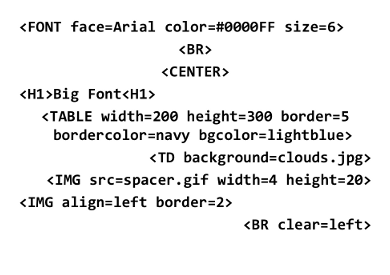

------------
**CSS Level 1**
    
    - Replacement styles of Font tags and BRs.
    - Width, height
    - padding, margins
    - background, border, fonts, list-styles
    - alignments & whitespace.

**CSS Level 2**
    
    - CSS Table display `display: table;`.
    - Lack of support in IE until version 8
    - Layout hacks with absolute positioning and floats

**CSS Level 3**
    
    - Became Modularized
    - Processing power (Selectors and Media Queries)
    - Decorative effects (multiple backgrounds, rounded corners, border images, and CSS gradients)
    - Typography and Internationalization (vertical text, custom fonts, and line-breaking and justification controls)
    - Layout (inline-block, flexbox, grid)

------------
# Float Main Purpose

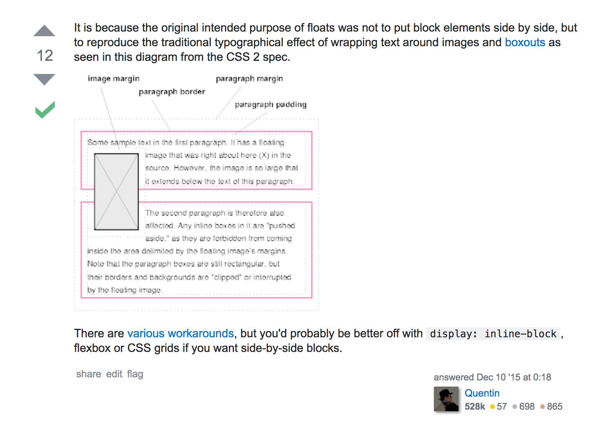

------------
# CSS3 Layout: New Modules

**CSS Multi-column Layout**

Just like in newspapers. `column-count: 2`, `column-width: 45px;`, `column-gap: 0`, `column-rule: thin solid black;`

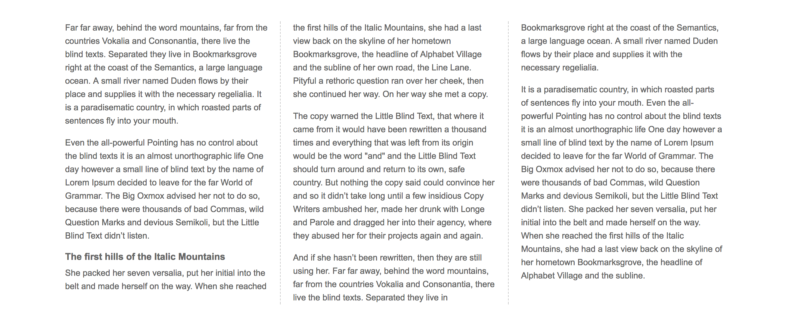

------------
**CSS Flexible Box Layout**
  
You can use flexes absolutely, where the proportions you give are the proportions you get; or you can use them relatively, where leftover space is distributed after you've assigned sizes based on the content.

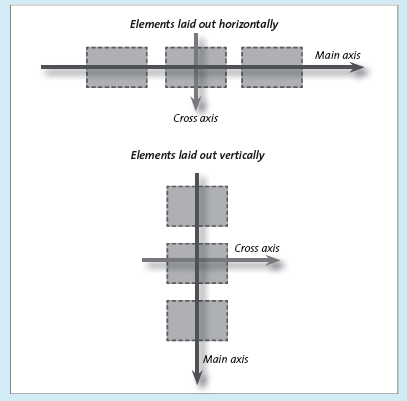

------------
**Grid Template Layout**

You can create grid systems and control the positioning of grid items purely through CSS, a clear separation of concerns from HTML

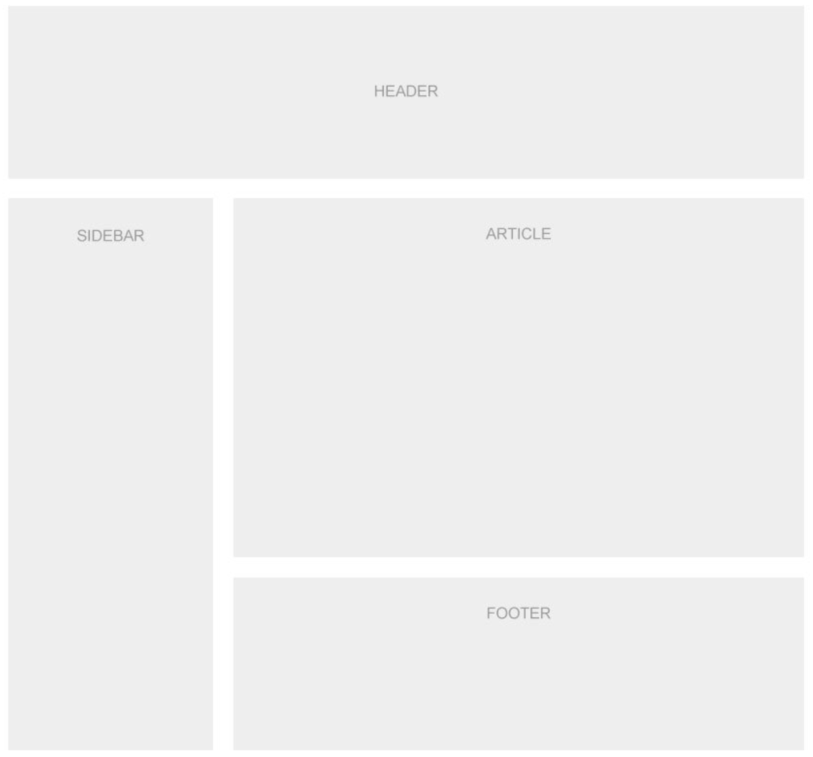

------------
# CSS Grid vs. Flexbox

”They work together, they don’t compete with each other”

| Flexbox       | Grid          |
|:-------------:|:-------------:|
| No Page Layouts      | Page Layouts |
| UI elements      | UI elements     |
| One-dimensional / x-axis OR y-axis | Two-dimensional / x-axis AND y-axis      |
| Content out | Layout in |
| Responsive (Fexible and Fluid) [flex-basis, flex-wrap] | Responsive (Fexible and Fluid) [minmax, fr] |
|Space distribution | Space distribution |
| No Gaps (Gutters) | No Gaps (Gutters) |
| Horizontal Alignment for all items | Horizontal Alignment for all items |
| No Horizontal Alignment for individual items | Horizontal Alignment for individual items |
|Vertical Alignments for all items and individual items | Vertical Alignments for all items and individual items |

------------
# CSS Box Alignment Specification
Remember the hellish ordeal of Vertical Alignment?

The new specification includes **content distribution** and **self-alignment** features that can be applied to block elements either in Flexbox or Grids.

**Inline Axis** is referred to as the `Row Axis` in the `Grid` specification and in `Flexbox` as the `Main Axis`.

(justify-items and justify-self)

**Block Axis** is referred to as the `Column Axis` in the Grid specification and in Flexbox as the `Cross Axis` as it runs across the Main Axis.

(align-self and align-items)

------------
# Flexbox Layout (Content out)


Play with [flexbox](http://the-echoplex.net/flexyboxes/)

----------
# Grid Layout (Layout in)

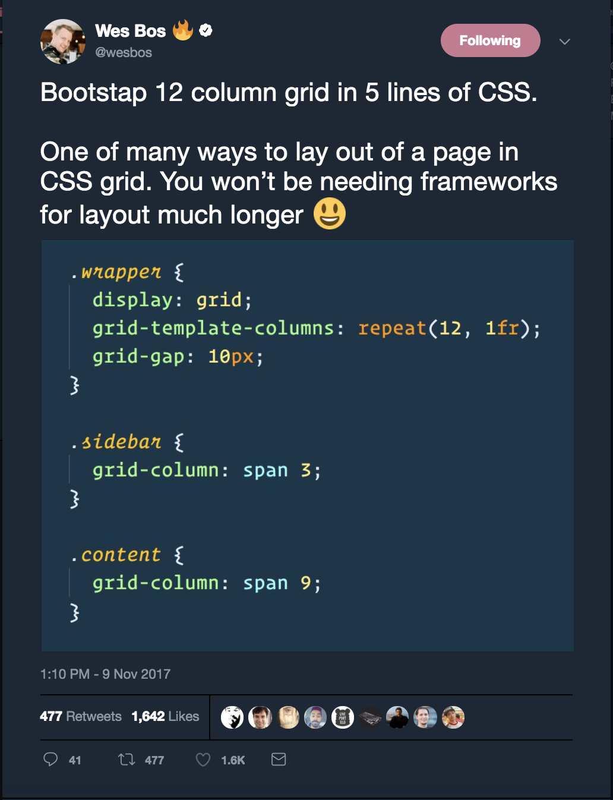


----------
## CSS grid layout has the following features
- Item placement
- Creation of additional tracks to hold content
- Alignment control
- Control of overlapping content

----------

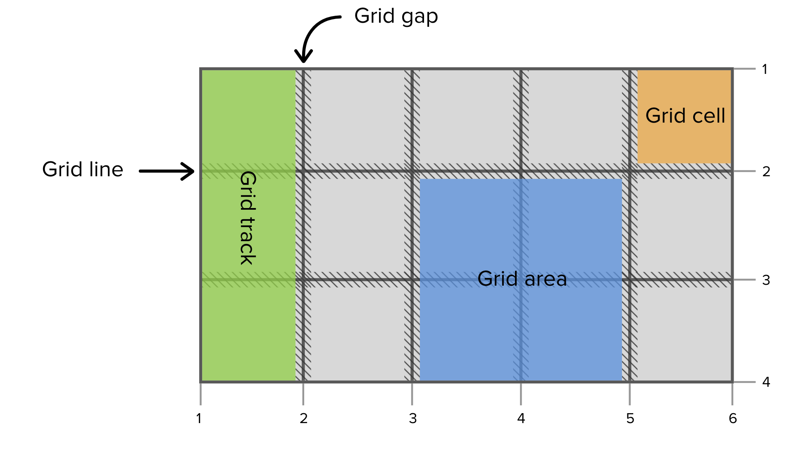

------------
# Grid Line-based placement

[Simple grid and flexbox with line-based placement](https://codepen.io/nouranology/pen/qVRrGB?editors=1100)

------------
# Grid Template Area
[Simple Grid and flexbox example with area placement](https://codepen.io/nouranology/pen/yPgVor?editors=1100)

------------

# Auto placement

[Auto flow](https://codepen.io/nouranology/pen/xPqzmw)

------------

# Alignment
[Grid Alignment Properties Visualisation](https://codepen.io/nouranology/pen/QOpxoJ)

------------

# Responsive layout is now fun

## Desktop screen
```css

container {
 display: grid;
 grid-template-columns: repeat(3, 1fr);
 grid-template-rows: 100px 400px 100px 100px;
 grid-gap: 10px;

 grid-template-areas: 'header header header'
                      'sidebar article article'
                      'sidebar footer footer';
}

.header { grid-area: header }
.sidebar { grid-area: sidebar }
.article { grid-area: article }
.footer { grid-area: footer }
```


------------

## Mobile screen
```css
@media screen and (max-width: 768px) {
  .container {
    grid-template-areas: 'header header header'
                         'article article article'
                         'sidebar sidebar sidebar'
                         'footer footer footer';
  }
}
```


------
# Can I use it?

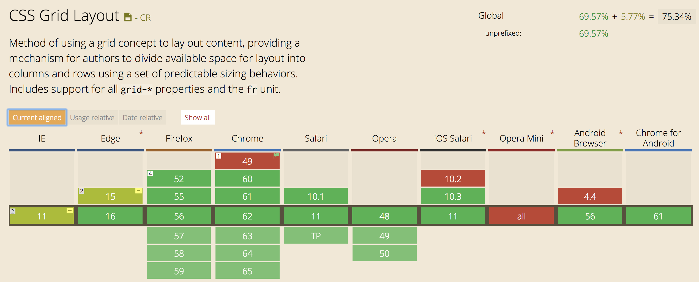
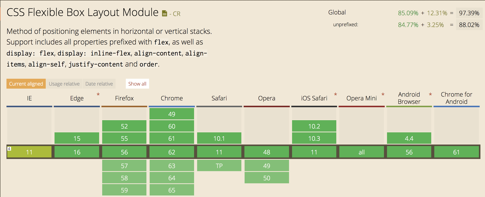

------
# Your New Friend (Feature Queries)

```css

body {
  --bg-color: #98FB98;
  background-color: khaki;
}
 
@supports (background-color: var(--bg-color)) {
  body {
    background-color: var(--bg-color);
  }
}
 
@supports not(background-color: var(--bg-color)) {
  body {
    background-color: tomato;
  }
}
```

------
## Safari ( does not implement @support)
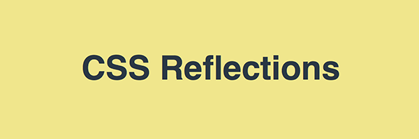

------
## Chrome (implement @support but does not implement variables)


------
## Firefox (implement @support and implement variables)


------
# Designers will relate

```css
#container {
  /* 1: Set the width */
  width: 960px;

  /* Invoke the grid */
  display: grid;

  /* 2: Define the columns, in this case 12 columns with liquid width */
  grid-template-columns: repeat(12, 1fr);

  /* Define 8 rows with 110px of height */
  grid-template-rows: repeat(8, 110px);

  /* 3: And the gap width 10px */
  grid-gap: 10px;
}


.box {
  /* Occupy the third to the eleventh column row */
  grid-column: 3/11;

  /* And occupy the region from 1 to 2 line */
  grid-row: 1/2;
}
```

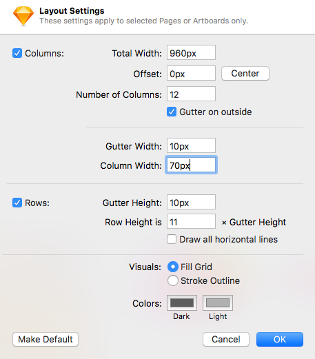

------------

## Learn flexbox and Grid
[Grid Garden Game](http://cssgridgarden.com/)
[Flexbox Froggy](http://flexboxfroggy.com/)

[gridbyexample](gridbyexample.com)
[flexbox from wesbos](https://flexbox.io/)

## People to follow
[Rachel Andrew](http://rachelandrew.co.uk/)
[Wesbos]()

-----------

## Resources

* https://cheesecakelabs.com/blog/dear-designers-love-developers-learned-display-grid/
* http://fantasai.inkedblade.net/weblog/2012/css-layout-evolution/
* http://maketea.co.uk/2016/09/28/css-grid-layout-is-a-step-change.html
* https://webdesign.tutsplus.com/tutorials/css-feature-detection-modernizr-or-feature-queries--cms-23508
* https://aerolab.co/blog/flexbox-grids/